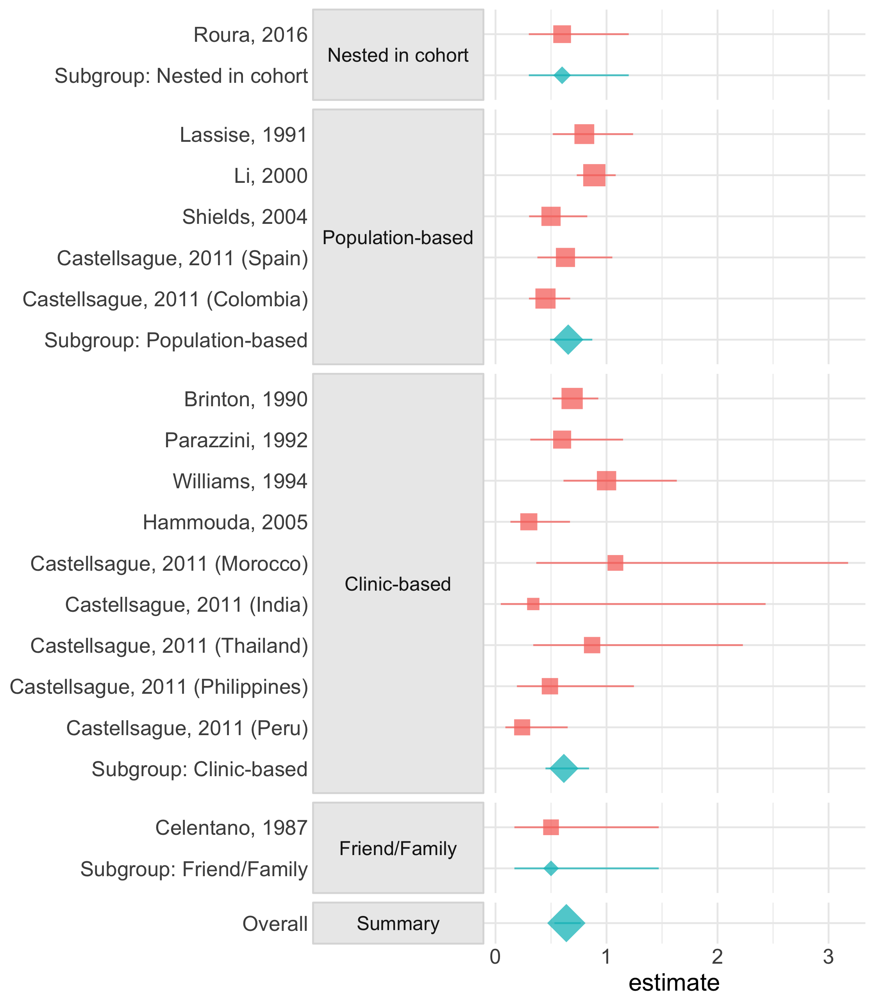
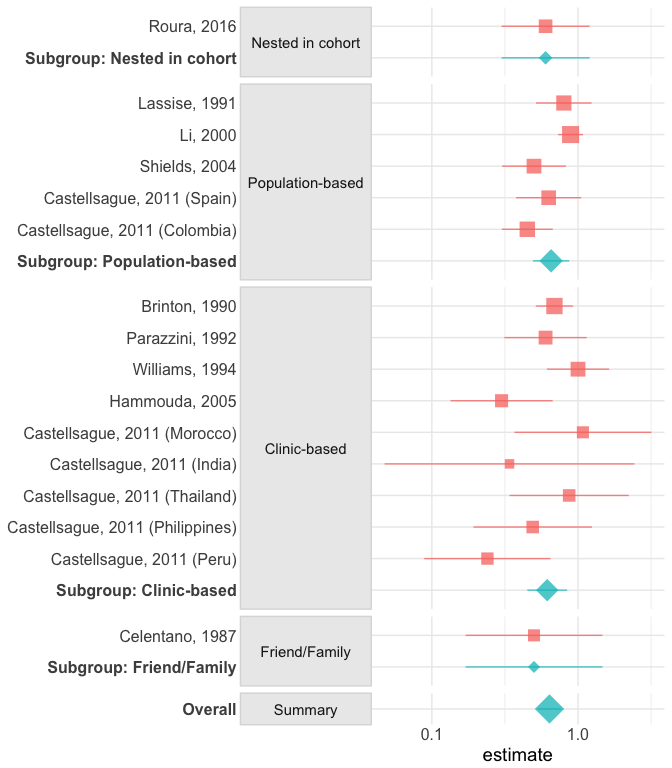

<!-- README.md is generated from README.Rmd. Please edit that file -->

[](https://travis-ci.org/malcolmbarrett/tidymeta)
[](https://ci.appveyor.com/project/malcolmbarrett/tidymeta)
\# tidymeta

Tidy and plot meta-analyses from popular meta-analytic tools in R.
Currently in early development.

## Installation

`tidymeta` requires the development version of several packages,
including `ggplot2`, to function correctly. You can install the required
packages for this vignette with the following code:

``` r
install.packages(c("devtools", "yaml", "ggrepel"))
library(devtools)
install_github("r-lib/rlang")
install_github("malcolmbarrett/tidymeta")
install_github("malcolmbarrett/mbmisc")
install_github("tidyverse/ggplot2")
```

# Tidy Meta-Analysis

`tidymeta` is a toolkit for working with meta-analyses in R. Currently,
it includes a data set, called `iud_cxca`, for a meta-analysis of the
relationship between IUD use and cervical cancer.

``` r
library(tidymeta)
library(ggplot2)
library(dplyr)
library(broom)

iud_cxca
#> # A tibble: 16 x 26
#>    study_id study_name    author    es    l95   u95    lnes  lnl95   lnu95
#>       <int> <chr>         <chr>  <dbl>  <dbl> <dbl>   <dbl>  <dbl>   <dbl>
#>  1        1 Roura, 2016   Roura  0.600 0.300  1.20  -0.511  -1.20   0.182 
#>  2        2 Lassise, 1991 Lassi… 0.800 0.500  1.20  -0.223  -0.693  0.182 
#>  3        3 Li, 2000      Li     0.890 0.730  1.08  -0.117  -0.315  0.0770
#>  4        4 Shields, 2004 Shiel… 0.500 0.300  0.820 -0.693  -1.20  -0.198 
#>  5        5 Castellsague… Caste… 0.630 0.380  1.06  -0.462  -0.968  0.0583
#>  6        6 Castellsague… Caste… 0.450 0.300  0.670 -0.799  -1.20  -0.400 
#>  7        7 Brinton, 1990 Brint… 0.690 0.500  0.900 -0.371  -0.693 -0.105 
#>  8        8 Parazzini, 1… Paraz… 0.600 0.300  1.10  -0.511  -1.20   0.0953
#>  9        9 Williams, 19… Willi… 1.00  0.600  1.60   0.     -0.511  0.470 
#> 10       10 Hammouda, 20… Hammo… 0.300 0.100  0.500 -1.20   -2.30  -0.693 
#> 11       11 Castellsague… Caste… 1.08  0.370  3.20   0.0770 -0.994  1.16  
#> 12       12 Castellsague… Caste… 0.340 0.0500 2.56  -1.08   -3.00   0.940 
#> 13       13 Castellsague… Caste… 0.870 0.340  2.23  -0.139  -1.08   0.802 
#> 14       14 Castellsague… Caste… 0.490 0.190  1.23  -0.713  -1.66   0.207 
#> 15       15 Castellsague… Caste… 0.240 0.0900 0.660 -1.43   -2.41  -0.416 
#> 16       16 Celentano, 1… Celen… 0.500 0.170  1.47  -0.693  -1.77   0.385 
#> # ... with 17 more variables: selnes <dbl>, group <fct>, case_num <dbl>,
#> #   control_num <dbl>, start_recruit <dbl>, stop_recruit <dbl>,
#> #   pub_year <dbl>, numpap <dbl>, ses <dbl>, gravidity <dbl>,
#> #   lifetimepart <dbl>, coitarche <dbl>, hpvstatus <dbl>, smoking <dbl>,
#> #   location <chr>, aair <dbl>, hpvrate <dbl>
```

`tidymeta` includes `broom` methods for cleaning meta-analysis results,
although it currently only supports the `metafor` package. The `tidy()`
function in `broom` puts results into a tidy data frame.

``` r
library(metafor)
#> Warning: package 'Matrix' was built under R version 3.4.4
meta4 <- rma(yi = lnes, sei = selnes, data = iud_cxca)
tidy(meta4) %>% 
  as_tibble() # for space
#> # A tibble: 17 x 8
#>    study   type   estimate std.error statistic  p.value conf.low conf.high
#>    <chr>   <chr>     <dbl>     <dbl>     <dbl>    <dbl>    <dbl>     <dbl>
#>  1 1       study   -0.511     0.354     -1.44  NA         -1.20     0.182 
#>  2 2       study   -0.223     0.223     -0.999 NA         -0.661    0.215 
#>  3 3       study   -0.117     0.0999    -1.17  NA         -0.312    0.0793
#>  4 4       study   -0.693     0.257     -2.70  NA         -1.20    -0.190 
#>  5 5       study   -0.462     0.262     -1.77  NA         -0.975    0.0509
#>  6 6       study   -0.799     0.205     -3.90  NA         -1.20    -0.397 
#>  7 7       study   -0.371     0.150     -2.47  NA         -0.665   -0.0772
#>  8 8       study   -0.511     0.331     -1.54  NA         -1.16     0.139 
#>  9 9       study    0.        0.250      0.    NA         -0.490    0.490 
#> 10 10      study   -1.20      0.411     -2.93  NA         -2.01    -0.399 
#> 11 11      study    0.0770    0.550      0.140 NA         -1.00     1.16  
#> 12 12      study   -1.08      1.00      -1.07  NA         -3.05     0.889 
#> 13 13      study   -0.139     0.480     -0.290 NA         -1.08     0.801 
#> 14 14      study   -0.713     0.476     -1.50  NA         -1.65     0.221 
#> 15 15      study   -1.43      0.508     -2.81  NA         -2.42    -0.431 
#> 16 16      study   -0.693     0.550     -1.26  NA         -1.77     0.385 
#> 17 Overall summa…  -0.449     0.0941    -4.77   1.83e-6   -0.634   -0.265
```

`tidymeta` also includes wrapper functions for working with
meta-analysis packages in the context of the tidyverse. The main
function for this is `meta_analysis()`, which models and tidies the
object, as well as storing the results in the `meta` column to
facilitate other analysis.

``` r
#  same as above but stores the meta-analysis object
iud_cxca %>% 
  meta_analysis(yi = lnes, sei = selnes, slab = study_name)
#> # A tibble: 17 x 10
#>    study    type  estimate std.error statistic  p.value conf.low conf.high
#>    <chr>    <chr>    <dbl>     <dbl>     <dbl>    <dbl>    <dbl>     <dbl>
#>  1 Roura, … study  -0.511     0.354     -1.44  NA         -1.20     0.182 
#>  2 Lassise… study  -0.223     0.223     -0.999 NA         -0.661    0.215 
#>  3 Li, 2000 study  -0.117     0.0999    -1.17  NA         -0.312    0.0793
#>  4 Shields… study  -0.693     0.257     -2.70  NA         -1.20    -0.190 
#>  5 Castell… study  -0.462     0.262     -1.77  NA         -0.975    0.0509
#>  6 Castell… study  -0.799     0.205     -3.90  NA         -1.20    -0.397 
#>  7 Brinton… study  -0.371     0.150     -2.47  NA         -0.665   -0.0772
#>  8 Parazzi… study  -0.511     0.331     -1.54  NA         -1.16     0.139 
#>  9 William… study   0.        0.250      0.    NA         -0.490    0.490 
#> 10 Hammoud… study  -1.20      0.411     -2.93  NA         -2.01    -0.399 
#> 11 Castell… study   0.0770    0.550      0.140 NA         -1.00     1.16  
#> 12 Castell… study  -1.08      1.00      -1.07  NA         -3.05     0.889 
#> 13 Castell… study  -0.139     0.480     -0.290 NA         -1.08     0.801 
#> 14 Castell… study  -0.713     0.476     -1.50  NA         -1.65     0.221 
#> 15 Castell… study  -1.43      0.508     -2.81  NA         -2.42    -0.431 
#> 16 Celenta… study  -0.693     0.550     -1.26  NA         -1.77     0.385 
#> 17 Overall  summ…  -0.449     0.0941    -4.77   1.83e-6   -0.634   -0.265 
#> # ... with 2 more variables: meta <list>, weight <dbl>
```

`tidymeta` doesn’t actually do meta-analysis; it unifies existing tools
with the tidyverse. The benefit of this approach is that you can do
meta-analyses with tidy tools in mind. For example, if you want to
conduct a sub-group analysis, you can use the `group_by()` function from
`dplyr`. Here, `group` is a variable with information about study
design.

``` r
ma <- iud_cxca %>% 
  group_by(group) %>% 
  meta_analysis(yi = lnes, sei = selnes, slab = study_name, exponentiate = TRUE)

ma
#> # A tibble: 21 x 11
#>    group    study     type  estimate std.error statistic  p.value conf.low
#>    <fct>    <chr>     <chr>    <dbl>     <dbl>     <dbl>    <dbl>    <dbl>
#>  1 Nested … Roura, 2… study    0.600    0.354     -1.44  NA          0.300
#>  2 Nested … Subgroup… summ…    0.600    0.354     -1.44   0.149      0.300
#>  3 Populat… Lassise,… study    0.800    0.223     -0.999 NA          0.516
#>  4 Populat… Li, 2000  study    0.890    0.0999    -1.17  NA          0.732
#>  5 Populat… Shields,… study    0.500    0.257     -2.70  NA          0.302
#>  6 Populat… Castells… study    0.630    0.262     -1.77  NA          0.377
#>  7 Populat… Castells… study    0.450    0.205     -3.90  NA          0.301
#>  8 Populat… Subgroup… summ…    0.655    0.146     -2.90   0.00374    0.492
#>  9 Clinic-… Brinton,… study    0.690    0.150     -2.47  NA          0.514
#> 10 Clinic-… Parazzin… study    0.600    0.331     -1.54  NA          0.313
#> # ... with 11 more rows, and 3 more variables: conf.high <dbl>,
#> #   meta <list>, weight <dbl>
```

You can also do sensitivy analyses and cumulative analyses with
`sensitivity()` and `cumulative()`.

# Visualization for Meta-Analysis

`tidymeta` includes functionality for working with results in `ggplot2`,
including meta-analysis specific geoms (such as `geom_funnel()`) and
quick plots for common visualizations.

With tidy data, most data visualizations for meta-analyses are easy to
build from the ground up. Nevertheless, `tidymeta` has several quick
plot functions to make the process easier. `forest_plot()` takes a
tidied meta-analysis and plots the effect sizes.

``` r
fp <- ma %>% 
  forest_plot(group = group)

fp
```



Because the results are still `ggplot2` objects, it’s easy to make
changes to the plot to your liking.

``` r
fp <- fp + 
  scale_x_log() + 
  theme(axis.text.y = element_text(face = c("bold", rep("plain", 21))))

fp
```



`tidymeta` currently supports forest plots, funnel plots, influence
plots, and cumulative plots.
