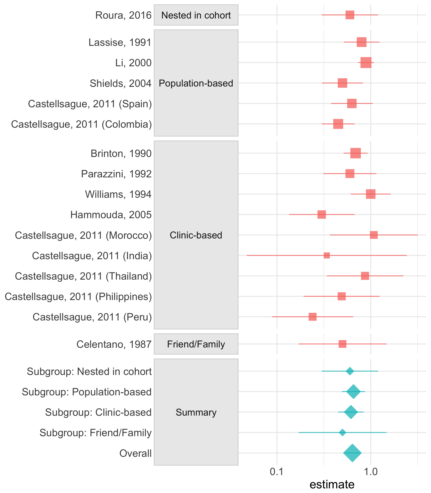

<!-- README.md is generated from README.Rmd. Please edit that file -->

# tidymeta

Tidy and plot meta-analyses from popular meta-analytic tools in R.
Currently in early development.

## Installation

You can install the development version of tidymeta from GitHub with:

``` r
# install.packages("devtools")
devtools::install_github("malcolmbarrett/tidymeta")
```

# Example

``` r
library(tidymeta)
library(dplyr)
library(ggplot2)

iud_cxca %>% 
  group_by(group) %>% 
  meta_analysis(yi = lnes, sei = selnes, slab = study_name, 
                exponentiate = TRUE) %>% 
  sub2summary(group) %>% 
  forest_plot(group = group) +
    scale_x_log()
```


